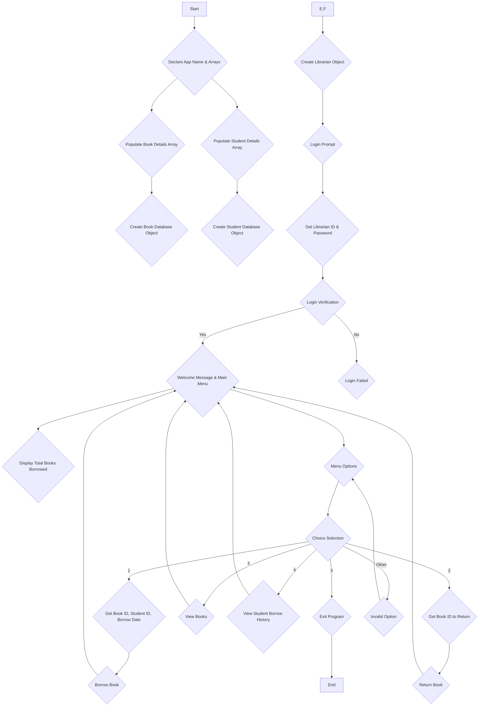
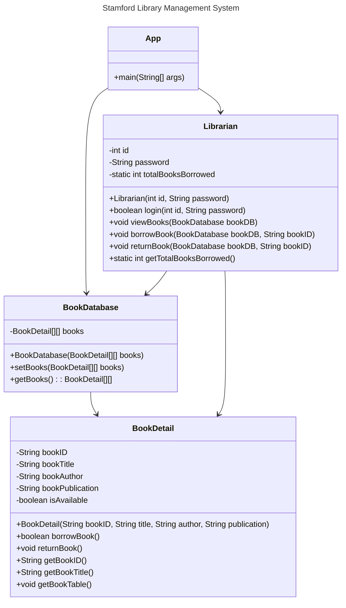

# Stamford Library Management System

## Written in Java

## Project Requirement

The project should cover at least **85%** of the topics covered during the 11-weeks of the course of ITE222.

#### Topics covered includes:

- [x] Loops- For while, do while, if and nested if , switch case
- [x] Constructors (Signatures) and methods
- [ ] Method overaloading
- [ ] creating classes and sub classes
- [x] Instantiating Objects
- [x] This keyword/ pointer , dot operator
- [x] Packages (Scanner, Random, Math, Joption pane)
- [x] Encapsulation
- [x] Object Interface and interactions
- [x] Dimensional Arrays
- [x] Static and variable methods
- [x] Declaring methods and fileds in proper names
- [x] Commenting
- [x] Access specifier/ Modifier.

_Note:_ No other topics shouldn't be  (which is not included in the syllabus ) used in the project. If so project with be cancelled and marked as Zero.

## Class Diagram

