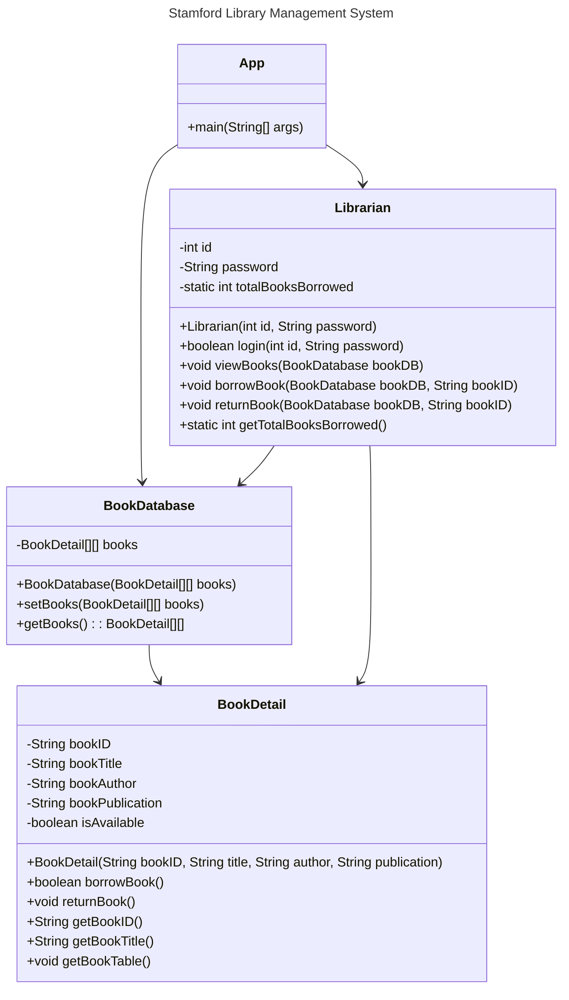

# Stamford Library Management System

## Written in Java

## Project Requirement

The project should cover at least 85% of the topics covered during the 11-weeks of the course of ITE222.

#### Topics covered includes:

- [x] Loops- For while, do while, if and nested if , switch case
- [x] Constructors (Signatures) and methods
- [ ] Method overaloading
- [ ] creating classes and sub classes
- [x] Instantiating Objects
- [x] This keyword/ pointer , dot operator
- [x] Packages (Scanner, Random, Math, Joption pane)
- [ ] Encapsulation
- [ ] Object Interface and interactions
- [x] Dimensional Arrays
- [x] Static and variable methods
- [x] Declaring methods and fileds in proper names
- [x] Commenting
- [ ] Access specifier/ Modifier.

_Note:_ No other topics shouldn't be  (which is not included in the syllabus ) used in the project. If so project with be cancelled and marked as Zero.

## Class Diagram



## Flowchart

```mermaid
---
title: Stamford Library Management System
---
flowchart TD
    A[Start] --> B[Initialize BookDetail array]
    B --> C[Initialize BookDatabase]
    C --> D[Create Librarian]
    D --> E[Prompt for login]
    E --> F{Login successful?}
    F --|No|--> G[Print "Login failed!"]
    F --|Yes|--> H[Display Main Menu]
    H --> I{Choose an option}
    I --|"1. View Books"|--> J[Call viewBooks]
    I --|"2. Borrow a Book"|--> K[Prompt for Book ID to borrow]
    K --> L[Call borrowBook]
    I --|"3. Return a Book"|--> M[Prompt for Book ID to return]
    M --> N[Call returnBook]
    I --|"4. Exit"|--> O[Print "Exiting..."]
    J --> H
    L --> H
    N --> H
    O --> P[End]
    G --> P
```
